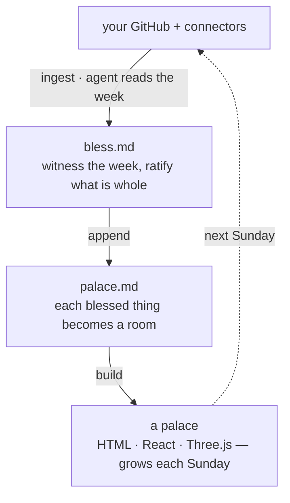

<div align="center">


# bless

*The Blessing Protocol — a weekly, agentic practice for witnessing the work you ship and growing a palace from it.*

[](LICENSE)
[](https://github.com/frankxai/Starlight-Intelligence-System)
[](SPEC.md)
[](https://github.com/frankxai/bless/actions/workflows/validate.yml)
[](CONTRIBUTING.md)

[**Why**](#why-this-exists) · [**The five files**](#the-five-files) · [**The weekly loop**](#the-weekly-loop) · [**Quick start**](#quick-start) · [**What blessing means**](#what-blessing-means-precise) · [**Spec**](SPEC.md) · [**Contribute**](CONTRIBUTING.md)

</div>

---

> Work for six days. On the seventh, bless the work.

`bless` is an open standard. It defines five small files any repository can adopt, one weekly ritual, and one honest attestation — so that an AI agent can read a builder's GitHub, witness what became whole this week, and render it as a palace that grows more beautiful over time.

This is not a productivity tracker and not a spirituality. It is a **closure practice**: naming a thing whole frees the attention the open loop was costing you (Zeigarnik). The "blessing" is the act of witnessing — nothing supernatural is claimed.

---

## Why this exists

Builders ship faster than they witness. Output piles up uncategorised; the memory of what was made goes stale; the next ambition gets seeded by restlessness instead of orientation. The bottleneck at high velocity is not production — it is the **witness**.

The practice is old. The Stoics did the evening review. Christian monastics kept the Examen. Jews keep Sabbath. Engineers run postmortems. Buddhists do sangha ratification. They encode one insight: *the work of witnessing is its own work, and complex systems become legible only at the right cadence.* Daily is too noisy; yearly too sparse. Weekly is the cadence where a system becomes visible to the one building it.

`bless` ports that practice into the agentic era — where the witness can be an agent reading your repos, and the artifact of witnessing can be a living, three-dimensional palace.

---

## The five files

Drop these into any repo (root or `.<name>/`). An agent that understands `bless` knows exactly what each means.

| File | Holds | One line |
|---|---|---|
| [`soul.md`](templates/soul.md) | Essence — what must not drift | *Who this is, and the test for whether it's still itself.* |
| [`agent.md`](templates/agent.md) | The repo's agent operating contract | *How agents behave here.* |
| [`skills.md`](templates/skills.md) | The repo's skills index | *What agents can do here, and when it fires.* |
| [`palace.md`](templates/palace.md) | The palace manifest | *How this repo's work becomes rooms.* |
| [`bless.md`](templates/bless.md) | The blessing ledger + ritual config | *What has been witnessed whole, and on what cadence.* |

Lowercase by intent: these are the **public builder tier**. They reconcile with the heavier substrate tier (`SKILL.md` / `AGENTS.md` / `SOUL.md`) defined by the [Starlight Intelligence Protocol](https://github.com/frankxai/Starlight-Intelligence-System). See [`SPEC.md` §6](SPEC.md) for the mapping.

---

## The weekly loop

Each Sunday, an agent reads the week, the ritual ratifies what is whole, and the palace accrues one ring of rooms.



1. **Ingest.** An agent rolls your week's commits across repos and surfaces what changed.
2. **Witness.** On Sunday you run the ritual. It blesses what is *whole at this moment*, names what to ignore for seven days, and surfaces Monday's one path.
3. **Grow.** Each blessing becomes a room. The palace accrues — week over week, more rooms, more beautiful.

Reference agent skills that perform these steps live in [`mind-palace-agent-skills`](https://github.com/frankxai/mind-palace-agent-skills). A reference adoption lives in [`frankx-mind-palace`](https://github.com/frankxai/frankx-mind-palace), rendered by [`frankx-palace`](https://github.com/frankxai/frankx-palace).

---

## Quick start

```bash
# 1. Copy the five templates into your repo
curl -sL https://raw.githubusercontent.com/frankxai/bless/main/templates/soul.md -o soul.md
# …repeat for agent.md, skills.md, palace.md, bless.md

# 2. Fill soul.md first (everything else inherits from it)
# 3. On Sunday, run the ritual with an agent that understands bless:
#    "Run the weekly blessing on this repo."
```

You do not need the full toolchain to start. The minimum viable practice is `bless.md` plus a Sunday habit. The palace is what the practice earns.

---

## What blessing means (precise)

> **Blessed = whole at this moment.** Further iteration is creator-restlessness, not improvement. Future-you may extend it from a new vantage; present-you does not.

Blessing is not permanent and not a promotion. New facts can break wholeness; new ambition can compose new rooms. When that happens, the next week's witness records it. Until then, the blessing stands.

The normative definition, the refusals the ritual must honor, the ledger and room schemas, and the SIP reconciliation all live in [`SPEC.md`](SPEC.md). The honest claim a practitioner may carry lives in [`ATTESTATION.md`](ATTESTATION.md).

---

## License

MIT. The spec, the templates, the file contract — open forever. See [`LICENSE`](LICENSE).

---

## The Blessing family

| Repo | Role |
|---|---|
| [**bless**](https://github.com/frankxai/bless) | The open standard — the Blessing Protocol |
| [**mind-palace-agent-skills**](https://github.com/frankxai/mind-palace-agent-skills) | Portable agent skills — ingest · witness · grow |
| [**frankx-mind-palace**](https://github.com/frankxai/frankx-mind-palace) | The mind — Frank's blessed work as data |
| [**frankx-palace**](https://github.com/frankxai/frankx-palace) | The palace — the 3D memory palace that grows each Sunday |

<sub>Built on SIP · The Blessing Protocol v0.1 · MIT</sub>
