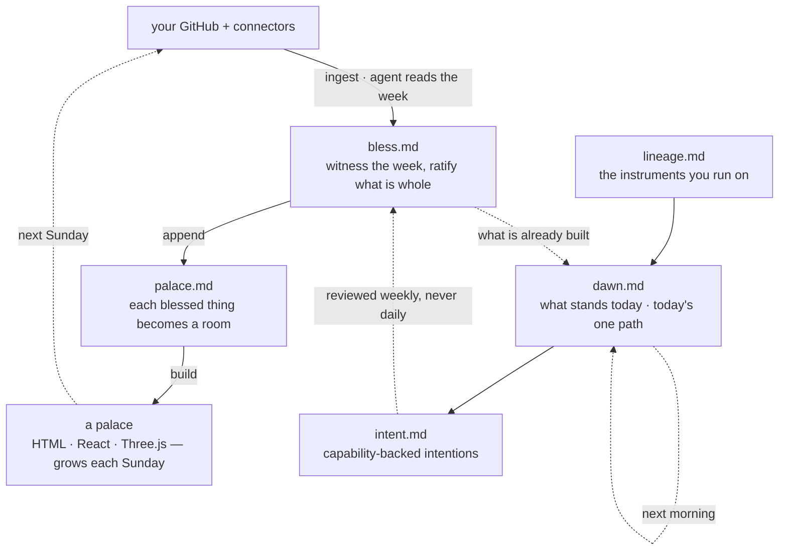

<div align="center">


# bless

*The Blessing Protocol — a weekly, agentic practice for witnessing the work you ship and growing a palace from it.*

[](LICENSE)
[](https://github.com/frankxai/Starlight-Intelligence-System)
[](SPEC.md)
[](https://github.com/frankxai/bless/actions/workflows/validate.yml)
[](CONTRIBUTING.md)

[**Why**](#why-this-exists) · [**The files**](#the-files) · [**The two loops**](#the-two-loops) · [**Quick start**](#quick-start) · [**What blessing means**](#what-blessing-means-precise) · [**Benevolence**](#benevolence-is-a-set-of-refusals) · [**Spec**](SPEC.md) · [**Contribute**](CONTRIBUTING.md)

</div>

---

> Work for six days. On the seventh, bless the work.
> Open each day by naming what already stands.

`bless` is an open standard. It defines eight small files any repository can adopt, two cadences, and one honest attestation — so that an AI agent can read a builder's GitHub, witness what became whole this week, witness the instruments that made it, and render both as a palace that grows more beautiful over time.

This is not a productivity tracker and not a spirituality. It is a **closure practice**: naming a thing whole is meant to ease the attention an open loop costs (the idea behind the Zeigarnik effect; this protocol does not test it). The "blessing" is the act of witnessing — nothing supernatural is claimed.

---

## Why this exists

Builders ship faster than they witness. Output piles up uncategorised; the memory of what was made goes stale; the next ambition gets seeded by restlessness instead of orientation. The bottleneck at high velocity is not production — it is the **witness**.

The practice is old. The Stoics did the evening review. Christian monastics kept the Examen. Jews keep Sabbath. Engineers run postmortems. Buddhists do sangha ratification. They encode one insight: *the work of witnessing is its own work, and complex systems become legible only at the right cadence.*

There are two things worth witnessing, and they run at different speeds:

- **What became whole** — weekly. Daily is too noisy for closure; yearly too sparse.
- **What already stands** — daily. The systems running, the agents and skills on hand, the projects already built, the judgment no instrument supplies. Capability that is not enumerated gets rebuilt instead of reused, and instruments absorbed from others go uncredited.

`bless` ports the practice into the agentic era — where the witness can be an agent reading your repos, and the artifact of witnessing can be a living, three-dimensional palace.

---

## The files

Drop these into any repo (root or `.<name>/`). An agent that understands `bless` knows exactly what each means.

**Core tier** — witnessing what was made:

| File | Holds | One line |
|---|---|---|
| [`soul.md`](templates/soul.md) | Essence — what must not drift | *Who this is, and the test for whether it's still itself.* |
| [`agent.md`](templates/agent.md) | The agent operating contract + benevolence charter | *How agents behave here, and what they refuse.* |
| [`skills.md`](templates/skills.md) | The repo's skills index | *What agents can do here, and when it fires.* |
| [`palace.md`](templates/palace.md) | The palace manifest | *How this repo's work becomes rooms.* |
| [`bless.md`](templates/bless.md) | The blessing ledger + ritual config | *What has been witnessed whole, and on what cadence.* |

**Standing tier** — witnessing what is already available:

| File | Holds | One line |
|---|---|---|
| [`dawn.md`](templates/dawn.md) | The daily orientation | *What stands today, and the one path it supports.* |
| [`lineage.md`](templates/lineage.md) | The instruments — agents, skills, models, protocols | *What this runs on, and whether the credit has been paid.* |
| [`intent.md`](templates/intent.md) | Capability-backed intentions | *What this is being built toward, and what it refuses.* |

Lowercase by intent: these are the **public builder tier**. They reconcile with the heavier substrate tier (`SKILL.md` / `AGENTS.md` / `SOUL.md`) defined by the [Starlight Intelligence Protocol](https://github.com/frankxai/Starlight-Intelligence-System). See [`SPEC.md` §6](SPEC.md) for the mapping.

---

## The two loops

The day observes. The week ratifies. Collapsing the two destroys the value of both.


```mermaid
graph TD
    A["your GitHub + connectors"] -->|ingest · agent reads the week| B["bless.md<br/>witness the week, ratify what is whole"]
    B -->|append| C["palace.md<br/>each blessed thing becomes a room"]
    C -->|build| D["a palace<br/>HTML · React · Three.js — grows each Sunday"]
    D -.->|next Sunday| A

    E["lineage.md<br/>the instruments you run on"] --> F["dawn.md<br/>what stands today · today's one path"]
    B -.->|what is already built| F
    F -.->|next morning| F
    F --> G["intent.md<br/>capability-backed intentions"]
    G -.->|reviewed weekly, never daily| B
```

**Weekly — the blessing.**

1. **Ingest.** An agent rolls your week's commits across repos and surfaces what changed.
2. **Witness.** On Sunday you run the ritual. It blesses what is *whole at this moment*, names what to ignore for seven days, and surfaces Monday's one path.
3. **Grow.** Each blessing becomes a room. The palace accrues — week over week, more rooms, more beautiful.

**Daily — the orientation.** Under five minutes, 150–300 words. Name the four registers of standing capability — systems, instruments, built, human — then the one path they support and where today's attention goes. It never blesses: blessing needs a seven-day soak and stays weekly.

Reference agent skills that perform these steps live in [`mind-palace-agent-skills`](https://github.com/frankxai/mind-palace-agent-skills). A reference adoption lives in [`frankx-mind-palace`](https://github.com/frankxai/frankx-mind-palace), rendered by [`frankx-palace`](https://github.com/frankxai/frankx-palace).

---

## Witnessing the instruments

The core tier witnesses outputs. [`lineage.md`](templates/lineage.md) witnesses the **instruments** — the agents, models, skills and protocols you run on, including the ones you did not write.

Each gets a record: what it is, where it came from, its licence, what it does *for you*, and whether attribution is `honored`, `owed`, or `not-required`. Two rules carry the weight: an `unknown` licence must be resolved or the instrument removed, and a repo carrying the attestation block must have **zero** `owed` records.

That is the protocol's answer to honoring the technology you depend on. Not sentiment — a ledger. Attribution honored is gratitude that survives review, and it doubles as licence compliance and provenance you can hand to a reviewer.

An instrument that has done real work for seven days, with attribution honored and a known licence, can itself be blessed (`scope: instrument`) and become a room. The blessing means what it always means: *whole at this moment, not currently the constraint.* Not an endorsement, not a ranking. See [`SPEC.md` §11](SPEC.md).

---

## Benevolence is a set of refusals

"Benevolent AI" is an unfalsifiable adjective until you say what the system will not do. [`SPEC.md` §13](SPEC.md) defines it as six non-waivable clauses an agentic adopter carries in `agent.md`, inherited downward and never relaxed downward:

1. **Fail closed** — uncertainty resolves to the safe verdict, never the permissive one.
2. **Human gate on the irreversible** — agents draft, verify, gate; humans commit capital and anything that cannot be undone.
3. **Attribution honored** — nothing runs here with credit outstanding.
4. **Sovereignty is non-waivable** — read, export, leave. Plain text, append-only, locally owned.
5. **Refusal is a first-class output** — surfaced with a reason a human can act on, and logged.
6. **No capability claim without a ledger entry** — claims trace to a blessing, a lineage record, or a passing test.

A charter that exists only as prose is a charter that has not been tested. Adopters should make clauses 1, 2 and 5 an executable gate in front of any action, and clauses 3 and 6 a ledger check. A reference implementation — Queens scoped to a single vertical, each holding the charter over a worker mesh — lives in [`starlight-swarm`](https://github.com/frankxai/starlight-swarm).

---

## On gratitude, and the words this protocol refuses

Adopters often arrive from a gratitude or manifestation practice, and the [voice register](SPEC.md) refuses that vocabulary — *manifest, abundance, energy, alignment*. The refusal is about the words, not about what is meant by them. Every one points at something real; the protocol's position is that the word is not falsifiable and the mechanism is.

| What is meant | What the protocol implements |
|---|---|
| gratitude for what you have | **capability inventory** — enumerate what stands before proposing new work |
| gratitude toward the tools / the AI | **attribution honored** — named, sourced, licensed, credited |
| manifesting an outcome | **capability-backed intention** — dated, falsifiable, standing on ledgered capability |
| abundance | **standing capability** — the enumerated, non-hypothetical total |
| energy | **attention budget** — the finite thing the day actually allocates |
| alignment | **charter conformance** — refusals that hold under unanticipated load |

An intention here needs two things a wish never has: a non-empty `standsOn` (blessings and instruments that make it reachable — without one it is a wish, and the ritual refuses to write it) and a non-empty `refuses` (what you will not do to get there). Plus a horizon and a falsifier. An inventory you can diff is worth more than a feeling you cannot.

---

## Quick start

```bash
# 1. Copy the templates you need into your repo
curl -sL https://raw.githubusercontent.com/frankxai/bless/main/templates/soul.md -o soul.md
# core:     …repeat for agent.md, skills.md, palace.md, bless.md
# standing: …and for dawn.md, lineage.md, intent.md

# 2. Fill soul.md first (everything else inherits from it)
# 3. Tomorrow morning, orient:
#    "Run the daily orientation on this repo."
# 4. On Sunday, run the ritual with an agent that understands bless:
#    "Run the weekly blessing on this repo."
```

You do not need the full toolchain to start. The minimum viable practice is `bless.md` plus a Sunday habit. If you run agents you did not write, add `lineage.md` next — it is the one file that turns "I use a lot of AI" into something a reviewer can check. The palace is what the practice earns.

---

## What blessing means (precise)

> **Blessed = whole at this moment.** Further iteration is creator-restlessness, not improvement. Future-you may extend it from a new vantage; present-you does not.

Blessing is not permanent and not a promotion. New facts can break wholeness; new ambition can compose new rooms. When that happens, the next week's witness records it. Until then, the blessing stands.

The normative definition, the refusals the ritual must honor, the ledger and room schemas, and the SIP reconciliation all live in [`SPEC.md`](SPEC.md). The honest claim a practitioner may carry lives in [`ATTESTATION.md`](ATTESTATION.md).

---

## License

MIT. The spec, the templates, the file contract — open forever. See [`LICENSE`](LICENSE).

---

## The Blessing family

| Repo | Role |
|---|---|
| [**bless**](https://github.com/frankxai/bless) | The open standard — the Blessing Protocol |
| [**mind-palace-agent-skills**](https://github.com/frankxai/mind-palace-agent-skills) | Portable agent skills — ingest · witness · grow |
| [**frankx-mind-palace**](https://github.com/frankxai/frankx-mind-palace) | The mind — Frank's blessed work as data |
| [**frankx-palace**](https://github.com/frankxai/frankx-palace) | The palace — the 3D memory palace that grows each Sunday |
| [**starlight-swarm**](https://github.com/frankxai/starlight-swarm) | Reference charter-holding coordinator — Queens over a worker mesh |

<sub>Built on SIP · The Blessing Protocol v0.2 · MIT</sub>

<!-- STARLIGHT:OPERATING:BEGIN v2 sha=9f8fecc91edc source=794db1e51a55a128816f7aa266eb0ac1dbd452c3 -->

## Agent operating guidance

Repository agents use the shared Starlight operating contract in `AGENTS.md` alongside local instructions.
The contract asks agents to establish a useful outcome, select relevant skills, complete authorized work,
verify current sources, refine the actual artifact, and report evidence and remaining gates.
It covers human agency, privacy, rights, resource stewardship and bounded proactivity.
Repository identity, brand, canon, build commands and release gates remain local.

[Pinned contract](https://github.com/frankxai/Starlight-Intelligence-System/blob/794db1e51a55a128816f7aa266eb0ac1dbd452c3/docs/architecture/agents-md/band-a.md)
· [Projection and verification](https://github.com/frankxai/Starlight-Intelligence-System/blob/794db1e51a55a128816f7aa266eb0ac1dbd452c3/docs/architecture/AGENTS-MD-CONTRACT.md)

These files supply operating guidance. They do not activate an agent, grant tool permissions,
schedule recurring work, certify compliance or prove a live capability.

<!-- STARLIGHT:OPERATING:END -->
